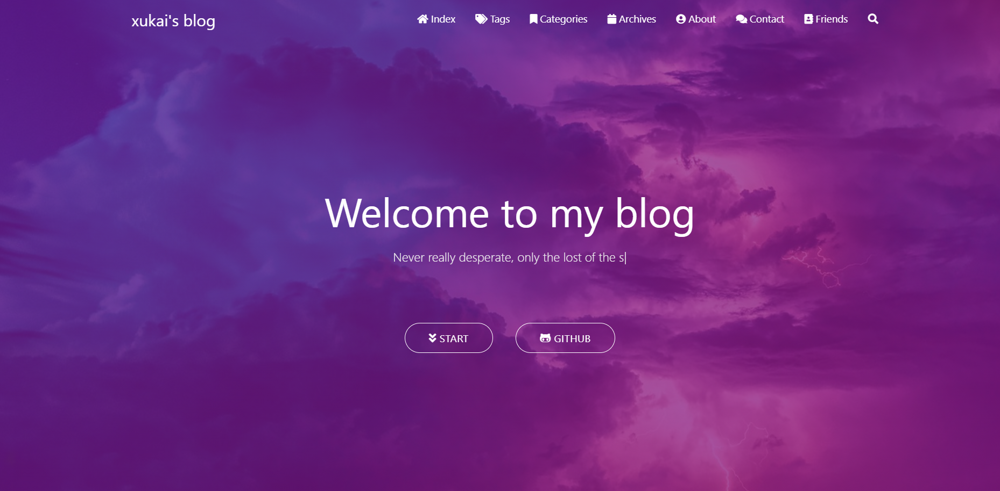
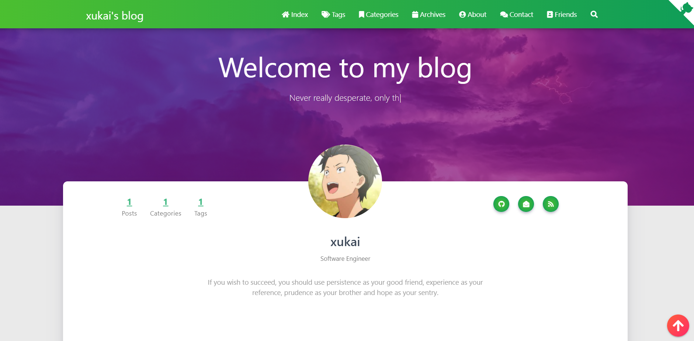

# My personal blog

## Features

- Simple and beautiful
- Responsive design, which can be displayed well on desktop, tablet, mobile phone, etc.
- Blog posts list with waterflow (There will be 24 images if the article doesn't have featured pictures).
- Archive page with timeline.
- Tags page of the **word cloud** and categories page of the **radar chart**
- About myself page
- My friends link page
- Support post topping and rewards
- TOC
- Comment module
- Support the `emoji` emoticon and use the `markdown emoji` grammar to directly generate the corresponding emoticon.

## Screenshot

### Home page

### About myself page

